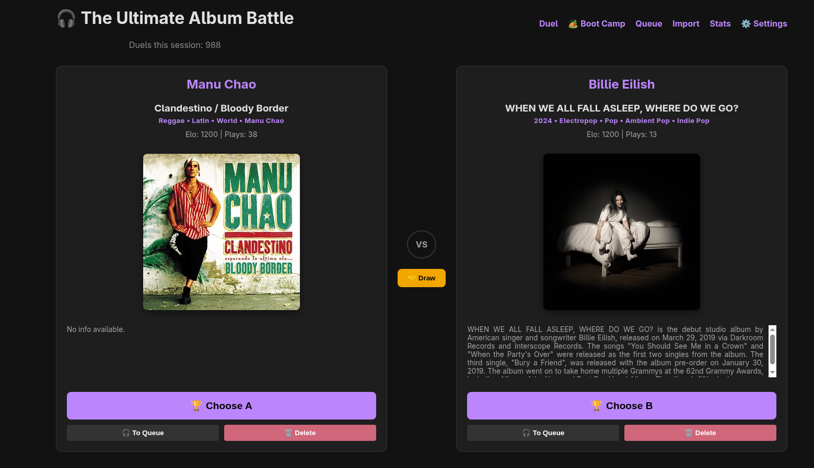
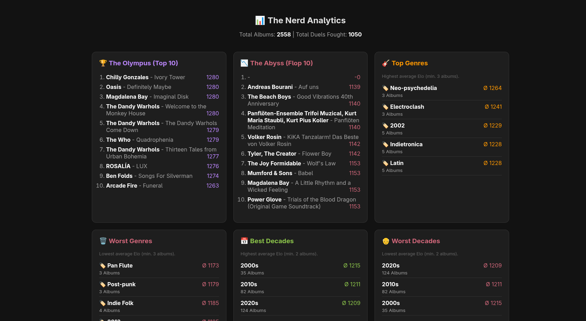
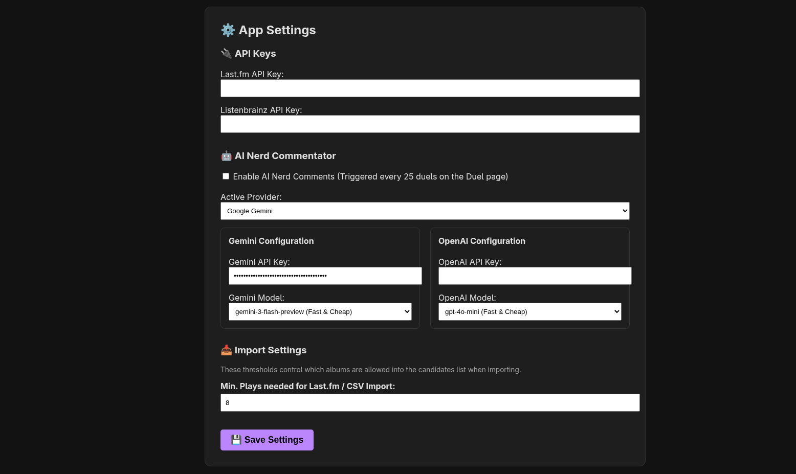
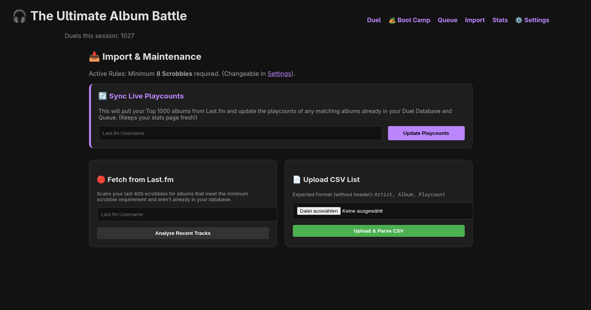

# 🎧 The Album Fights (Album Duel Engine)


A web-based, Elo-driven application that helps you definitively rank your favorite music albums by pitting them against each other in 1v1 duels.  
Inspired by Flickchart, but built for music nerds.

---

## ✨ Features

- **🧮 Elo Rating System:** Mathematically sort your taste over time based on 1v1 matchups.
- **🥊 Tiered Matchmaking:** Forces albums in similar brackets to fight, preventing ranking stagnation.
- **🎵 Last.fm Integration:** Fetch scrobbles, import your Top 1000, and sync live play counts.
- **🤖 AI Music Snob:** Connect OpenAI or Gemini to get witty, snobbish roasts of your taste every 25 duels.
- **🪖 The Boot Camp:** An on-demand, deep-dive AI assessment of your current Top 50.

---

## 📸 Screenshots

> Put images in `docs/screenshots/` and update the filenames below.

| Duel view | Rankings |
|---|---|
|  |  |

| Settings | Import |
|---|---|
|  |  |

---

## 📊 Demo (GIF)

> Put the GIF in `docs/demo/` (or anywhere you like) and update the path below.


---

## 🚀 Quick Start (The Easy Way)

The fastest way to get started is using the pre-built Docker image.  
You don't even need to clone the code!

### 1️⃣ Create a file named `docker-compose.yml`

Paste this inside:

```yaml
version: '3.8'

services:
  album-fights:
    image: earlofburl/album-fights:latest
    container_name: album-fights
    ports:
      - "8989:80"
    volumes:
      - ./data:/var/www/html/data
      - ./cache:/var/www/html/cache
    restart: unless-stopped
```

### 2️⃣ Launch the app

Run this command in your terminal from the same folder:

```bash
docker-compose up -d
```

### 3️⃣ Open your browser

```
http://localhost:8989
```

Start ranking! 🎶

---

## ⚙️ Configuration

On your first launch, click on **⚙️ Settings** to set up your engine:

### 🔑 Last.fm API Key
Required for:
- Album artwork  
- Genre metadata  
- Scrobble imports  

### 🤖 AI Provider
Provide an **OpenAI** or **Gemini** API key to enable the AI Nerd.

### 🎚 Import Thresholds
Set minimum play counts required for an album to be eligible for duels.

---

## 📂 Data Persistence

Your data is stored locally in the folder where you created your `docker-compose.yml`:

```
/data   → Contains API keys, settings, and elo_state.csv rankings
/cache  → Stores downloaded album artwork
```

### 💾 Backup Tip
To move your rankings to a new computer, simply copy the `/data` folder.

---

## 📜 License

MIT License.  
Rank your music, defend your taste — and don’t take the AI’s roasts too personally.
