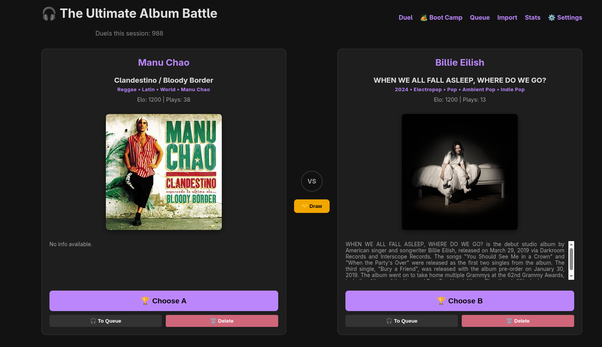
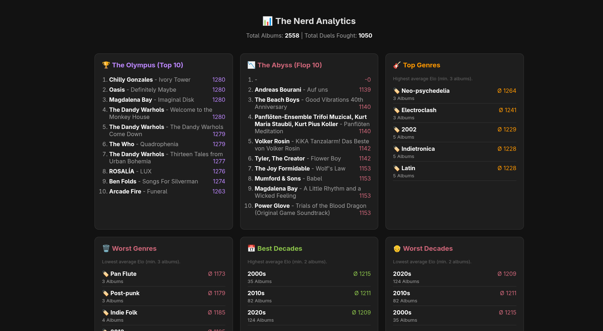
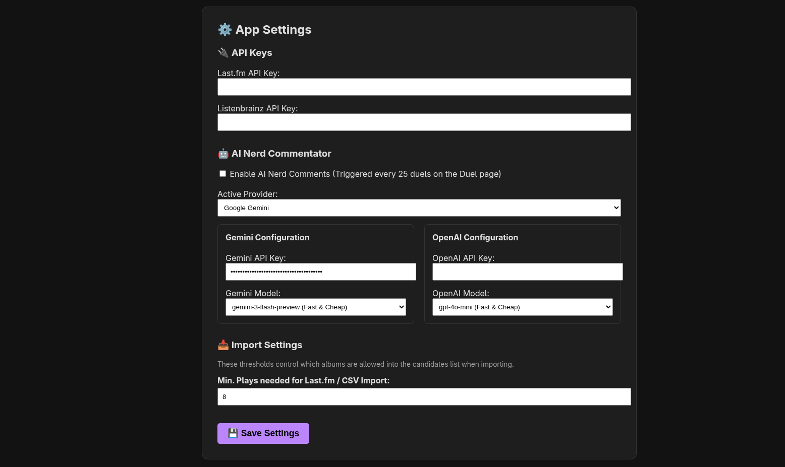
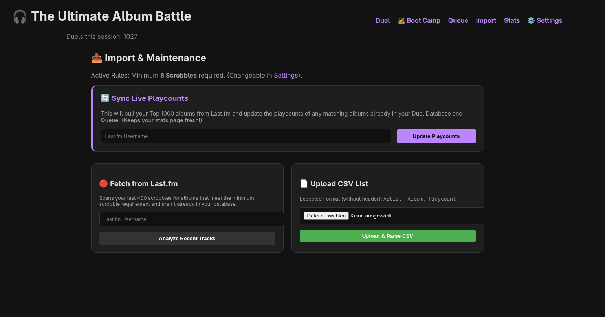

# 🎧 The Album Fights (Album Duel Engine)


A web app for ranking albums with an Elo system via 1v1 duels.
Inspired by Flickchart, but focused on albums.

---

## ✨ Feature Overview

### Core Duel Engine
- **Elo-based ranking** with win/loss/draw support.
- **Weighted matchmaking categories** (Top 25 / Top 50 / Top 100 / high playcount / never-dueled / random).
- **Configurable category weights** in Settings (normalized to 100%).
- **Session-safe duel handling** (current duel is kept stable until voted).
- **Quick actions in duel view**: send album to queue or delete it.
- **Top 20 live table** directly on the duel page.

### Metadata & artwork
- Album metadata + cover caching in `/cache`.
- Multi-source metadata pipeline:
  1. Navidrome/Subsonic (local server first when configured)
  2. Last.fm
  3. ListenBrainz/MusicBrainz + Cover Art Archive
  4. iTunes (final fallback)
- Cached metadata is refreshed strategically (e.g. enrichment for missing year/genres).

### Import & maintenance
- **Sync playcounts** from Last.fm, ListenBrainz, or Navidrome/Subsonic top albums (up to Top 1000).
- **Candidate import via API**
  - Most played mode (Top 100 / 200 / 500 / 1000)
  - Recent mode
  - Liked/Starred mode (Navidrome/Subsonic)
- **CSV upload import** with preview and selectable rows.
- **Bundled `1000_best_albums.csv` one-click preview**.
- Import destination per album or in bulk:
  - Duel DB (`elo_state.csv`)
  - Listening Queue (`listening_queue.csv`)
- Import threshold: minimum plays configurable in Settings.

### Queue workflow
- Dedicated queue page for parked albums.
- Restore queued albums back into duel DB.
- Delete queued albums permanently.

### Analysis & list views
- **Stats dashboard** with:
  - Top 10 / Flop 10
  - battle-hardened veterans
  - hidden gems / disappointments
  - top artists (power score)
  - best/worst genres and decades (derived from cached metadata)
- **The List page**:
  - sortable columns (Artist/Album/Elo/Duels/Playcount/Wins/Losses/W-L ratio)
  - pagination (100 per page)
  - CSV export of current sorting

### Database tools
- **Tag Blacklisting**:
  - maintain a blacklist of noisy metadata tags (e.g. from Last.fm)
  - blacklisted tags are excluded from stats and album metadata display
- **Duplicate Check & Resolve**:
  - fuzzy duplicate detection grouped by probable album matches
  - delete single duplicate rows
  - merge duplicate groups by selecting a primary entry
  - merge behavior: `Playcount` + `Duels` + `Wins` + `Losses` are summed, `Elo` is averaged

### AI features
- **AI Nerd comments** every 25 duels (optional).
- **Boot Camp page** for on-demand AI assessment of your current Top 50.
- Supports **OpenAI** and **Gemini**, selectable in Settings.

---

## 📸 Interface Preview

### 🥊 Duel Experience

<p align="center">
  
  
</p>

### ⚙️ Control Center

<p align="center">
  
  
</p>

---

## 🚀 Install

### Desktop Apps (Windows & Linux AppImage)

If you prefer a native desktop build, download it from the GitHub Releases page:

- **Desktop release (Windows + Linux AppImage):**
  https://github.com/EarlofBurl/album-fights/releases/

### Docker (with Compose)

### 1) `docker-compose.yml`

```yaml
version: '3.8'

services:
  album-fights:
    image: earlofburl/album-fights:latest
    container_name: album-fights
    ports:
      - "8989:80"
    volumes:
      - ./data:/var/www/html/data
      - ./cache:/var/www/html/cache
    restart: unless-stopped
```

### 2) Start

```bash
docker-compose up -d
```

### 3) Open

```text
http://localhost:8989
```

---

## ⚙️ Configuration

Use **Settings** in the UI for all runtime configuration.

### Integrations
- Last.fm API key
- ListenBrainz API key + optional default username
- Navidrome/Subsonic server settings (base URL, username, password/token)
- OpenAI API key + model
- Gemini API key + model

### Behavior toggles
- Enable/disable AI nerd comments
- Active AI provider
- Duel matchmaking category weights
- Import minimum plays threshold

> Settings are persisted in `data/settings.json`.

---

## 📂 Data & Persistence

Mounted directories:

```text
/data   -> CSV state + settings + bootcamp history + optional perf log
/cache  -> cached metadata JSON + downloaded cover images
```

Main files:

```text
data/elo_state.csv          # Duel database
data/listening_queue.csv    # Queue database
data/settings.json          # App settings
data/bootcamp_last.json     # Last bootcamp output + short history
```

Backup/migration: copy `/data` and `/cache`.

---

## 🏗️ Project Structure

```text
src/
  Core/               # Bootstrap, Config, Security (CSRF, Input), Session
  Repository/         # Data access (CSV Album/Queue, JSON Settings)
  Service/            # Business logic (Elo, Metadata, Import, Stats, AI, Duplicates)
  Utils/              # HTTP client, Subsonic client, CSV helpers
templates/
  partials/           # header.php, footer.php
  *.php               # One template per page view
includes/
  autoload.php        # Simple PSR-4 autoloader
  config.php          # Minimal bootstrap (session + autoload)
public entry points:  # index.php, list.php, stats.php, import.php, queue.php, bootcamp.php, database.php, settings.php, serve_image.php
```

All pages are thin controllers: they load services, handle the request, and render a template. Views contain no business logic.

---

## 🔒 Security

- **CSRF tokens** on every POST form.
- **Input validation** via `App\Core\Security` helpers.
- **Image proxy** (`serve_image.php`) validates filenames with strict regex (`album_<md5>.jpg`).
- **API keys** stored in `data/settings.json` (ensure this path is not web-accessible in production).

---

## 🧪 Dev: performance logging (optional)

Enable lightweight request timing logs:

```bash
APP_ENV=dev DEV_PERF_LOG=1
```

Output file:

```text
data/dev_perf.log
```

Disabled by default.

---

## 📜 License

MIT License.
